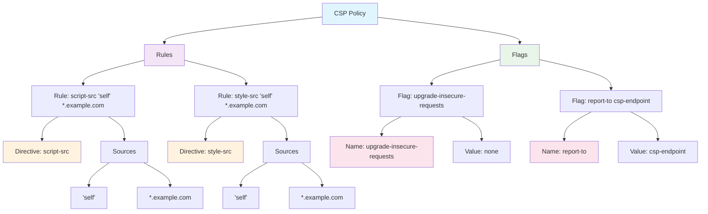

# content-security-policy-manager [experimental]

This module provides a `ContentSecurityPolicyManager` class for managing and serializing Content Security Policy (CSP) directives. The class allows adding directives to specific scopes. The class allows, on top of serializing it into a valid CSP header string, to expose the structure of the CSP as a table or JSON-compatible object, which is useful for management and review of the CSP directives by vendors.

## How do we manage CSP?

In this module, directives are managed by source rather than by directive name, reflecting the real-world focus of Content Security Policy (CSP) on defining trusted sources for various types of content. This source-first approach simplifies adding sources dynamically and allows for greater maintainability in larger CSP configurations.

By organizing the structure around sources we make a more intuitive way to manage CSP rules by vendors.

## CSP Structure and terminology

```plaintext
script-src 'self' *.example.com; style-src 'self' *.example.com; upgrade-insecure-requests; report-to csp-endpoint
|Directive| |---- Sources -----| |Directive| |---- Sources ----| |--------- Name ---------| |- Name | |- Value --|
|----------- Rule -------------| |----------- Rule ------------| |--------- Flag ---------| |------ Flag --------|
|------------------------------------------------------ Policy --------------------------------------------------|
```



## Usage

### Create a CSP

To create a new instance of ContentSecurityPolicyManager, simply instantiate the class:

```ts
import { ContentSecurityPolicyManager } from "content-security-policy-manager";

const csp = new ContentSecurityPolicyManager();
```

### Load a CSP Header

You can load a complete, or partial, CSP header string into the ContentSecurityPolicyManager instance using the load method:

```ts
csp.load(
	"script-src 'self' 'unsafe-inline' 'unsafe-eval' *.example.com https://example.com; style-src 'self' *.example.com https://example.com; upgrade-insecure-requests; report-to csp-endpoint",
);
```

### Add Directives to a Source

Add directives to a specific scope using the add method. Directives are stored in a set to avoid duplicates.

```ts
// What can "self" do?
csp.add("self", "default-src", "script-src");

// Add more to the same host
csp.add("self", "style-src");

// Chain
csp.add("unsafe-inline", "script-src").add("unsafe-eval", "script-src");

// Manage permissions by hostname
csp.add("*.example.com", "script-src", "img-src", "style-src");
```

### Set Flags

Flags are not tied to a specific source but apply globally to the entire document.

```ts
csp.set("upgrade-insecure-requests");
csp.set("require-trusted-types-for", "script");
csp.set("trusted-types", "allow-duplicates");
csp.set("plugin-types", "application/pdf", "application/x-shockwave-flash");
```

### Erase Flags

Erase a flag from the CSP.

```ts
csp.erase("upgrade-insecure-requests");
```

## Clear

To clear all directives and flags, use the clear method:

```ts
csp.clear();
```

### Adjust policy from CSP violation reports

You can adjust the policy based on the reports received from the browser. This is useful for fine-tuning the policy and ensuring that it is not too restrictive.

```ts
csp.adjust(
	{
		blockedURL: "inline",
		columnNumber: null,
		disposition: "report",
		documentURL: "https://www.website.com/",
		effectiveDirective: "script-src-elem",
		lineNumber: "86",
		originalPolicy:
			"img-src *; default-src 'self'; script-src *.mycdn.com; style-src *.mycdn.com; report-to csp-endpoint",
		referrer: "",
		sample: "",
		sourceFile: "https://www.website.com/",
		statusCode: "200",
	},
	{
		blockedURL:
			"https://assets.mycdn.com/assets/uploads/domaine-display-web-medium-italic.woff",
		columnNumber: null,
		disposition: "report",
		documentURL: "https://www.website.com/",
		effectiveDirective: "font-src",
		lineNumber: "7",
		originalPolicy:
			"img-src *; default-src 'self'; script-src *.mycdn.com; style-src *.mycdn.com; report-to csp-endpoint",
		referrer: "",
		sample: "",
		sourceFile: "https://www.website.com/",
		statusCode: "200",
	},
);
```

### Serialize to a CSP Header String

To serialize the CSP into a string format suitable for use as a Content-Security-Policy header, use the toString method:

```ts
request.headers.set("Content-Security-Policy-Report-Only", csp.toString());
```

This will output a string in the correct CSP header format:

```plaintext
script-src 'self' 'unsafe-inline' 'unsafe-eval' *.example.com https://example.com; style-src 'self' *.example.com https://example.com; upgrade-insecure-requests; report-to csp-endpoint
```

## Administrative Methods

The two methods help management, reports and review of the CSP directives by vendors.

### Serialize CSP to Table

Expose the structure of the CSP as a table: `csp.toTable()`.

```ts
[
	"rules",
	[
		["self", ["script-src", "style-src"]],
		["unsafe-inline", ["script-src"]],
		["unsafe-eval", ["script-src"]],
		["*.example.com", ["script-src", "style-src"]],
		["https://example.com", ["script-src", "style-src"]],
	],
	"flags",
	[
		["upgrade-insecure-requests", []],
		["require-trusted-types-for", ["script"]],
		["trusted-types", ["allow-duplicates"]],
		["plugin-types", ["application/pdf", "application/x-shockwave-flash"]],
	],
];
```

### Serialize CSP to JSON

Expose the structure of the CSP as a JSON-compatible object: `csp.toJSON()`.

```json
{
	"rules": {
		"self": ["script-src", "style-src"],
		"unsafe-inline": ["script-src"],
		"unsafe-eval": ["script-src"],
		"*.example.com": ["script-src", "style-src"],
		"https://example.com": ["script-src", "style-src"]
	},
	"flags": {
		"upgrade-insecure-requests": [],
		"require-trusted-types-for": ["script"],
		"trusted-types": ["allow-duplicates"],
		"plugin-types": ["application/pdf", "application/x-shockwave-flash"]
	}
}
```
